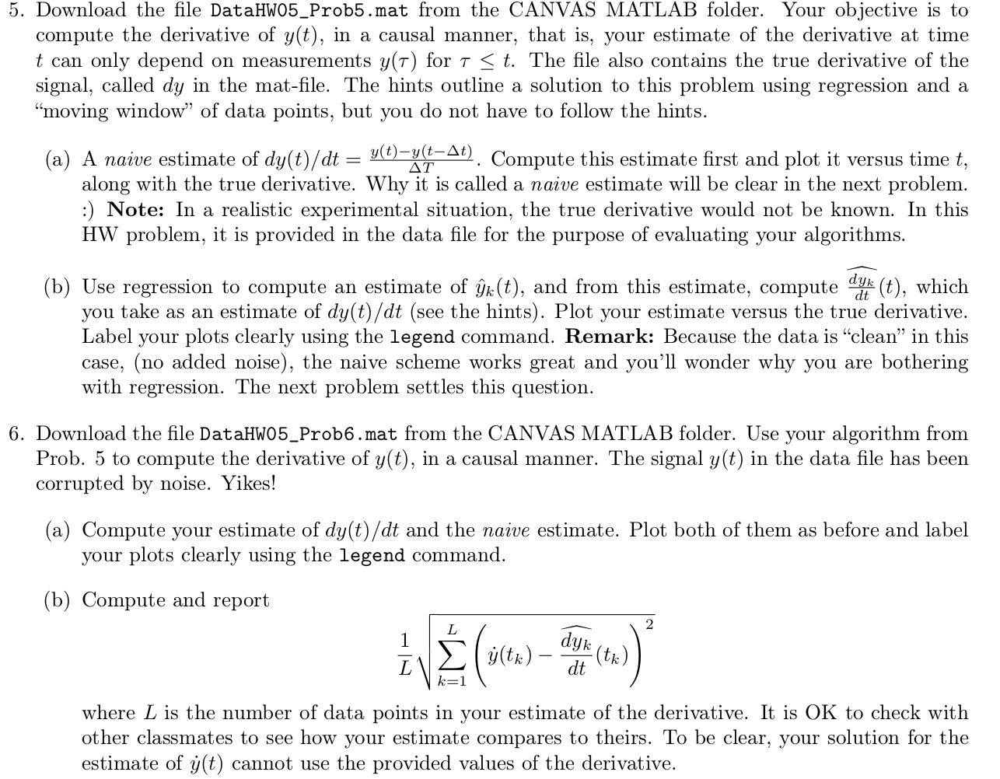

# Gradient Estimation

## Method
Estimation of gradient with backward estimation and regression estimation

## Problem

Credits to Prof. [Jessy Grizzle](http://web.eecs.umich.edu/faculty/grizzle/index.html)

## Method
Please find the HW05_Sol.pdf under this folder and look for solution
to problem 5(b).

It is basically a moving window for a polynomial regression and estimate
gradients based on the regression function.

## How to run
Run the Regression derivative estimation.py file you will see some 
magic happening.

